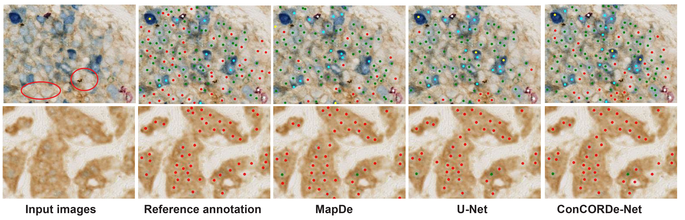

# ConCORDe-Net: Cell Count Regularized Convolutional Neural Network for Cell Detection in Multiplex Immunohistochemistry Images

## Description
ConCORDe-Net is a new cell detection method followed by multi-stage CNN to analyse mIHC images. Our work has the following main contributions: 
1) We developed Cell Count RegularizeD Convolutional neural Network (ConCORDe-Net) inspired by inception-v3 which incorporates cell counter and designed for cell detection without the need of pre-specifying parameters such as cell size. 
2) The parameters of ConCORDe-Net were optimized using an objective function that  combines conventional Dice overlap and a new cell count loss function which regularizes the network parameters to detect closely located cells. 
3) Our quantitative experiments support that ConCORDe-Net outperformed the state of the art methods at detecting closely located as well as weakly stained cells.

It is published in MICCAI 2019 and the full manuscript is available on [springer](https://link.springer.com/chapter/10.1007/978-3-030-32239-7_74) or [arxiv](https://arxiv.org/abs/1908.00907).

## Libraries required
- numpy==1.17.5
- scikit-image==0.16.2
- matplotlib==3.2.2
- opencv-python==4.1.2.30
- seaborn==0.10.1

## Running using Docker or Singularity image for running CONCORDe-Net
- Docker image: docker://yhagos/tf2gpu:concordenet
- See how to use them inside the cell detection and cell classification folders

## Implemetation flow chart

## Cell coult loss profile and cell classification performance evaluation

## Comparision with state of the art methods

